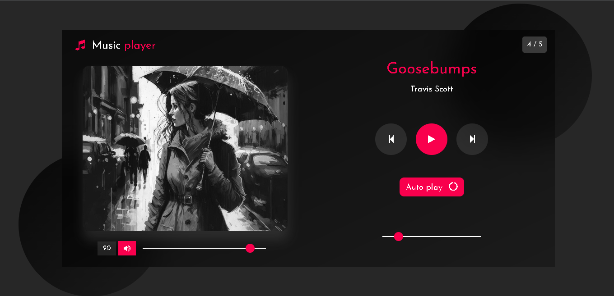

<h1 align="center">
    Music Player
</h1>

## Descrição

Um modelo de player de música, desenvolvido em javascript, o mesmo faz o uso de músicas
no copyright.

- Versão Final: [Music-Player](https://marcelo-abreeu.github.io/Music-Player/)

## Tecnologias

Esse projeto foi desenvolvido com as seguintes tecnologias:

- HTML
- CSS
- JAVASCRIPT

## Bibliotecas

- [Fonts Awesome](https://fontawesome.com/)
- [Google Fonts](https://fonts.google.com/)

-----

<h3 align="center"> Developed by <a href="#">Marcelo Abreu</a></h3>
